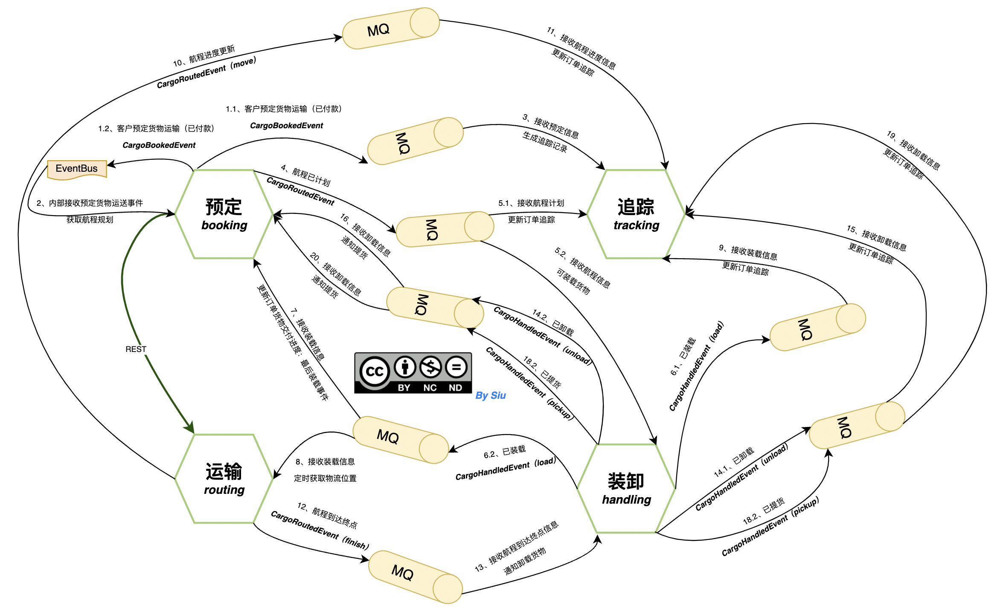
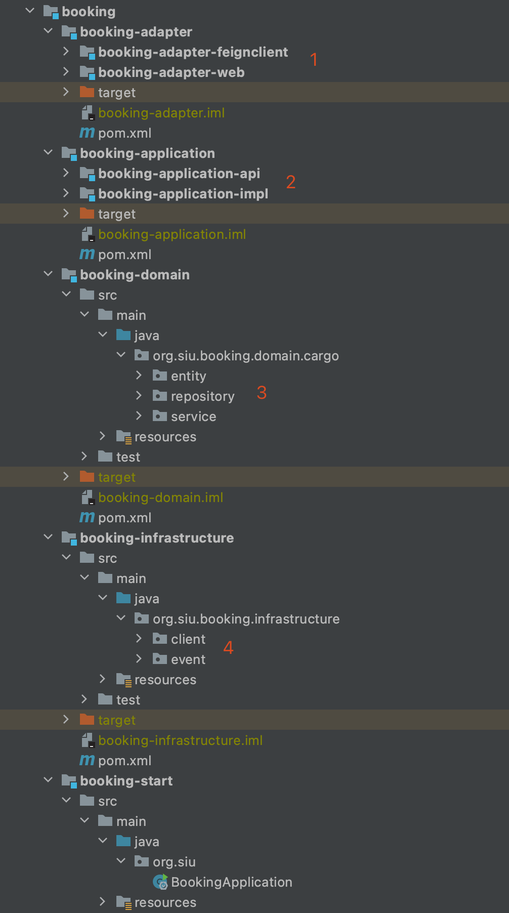

# Application Architecture Archetype（应用架构原型）
> By [Siu]() 2022/4/19


## 前言

年初一段时间在整理后端的架构和选型，关于微服务设计这部分，也预留 DDD 的“作业”（其实从19年就开始关注在项目中用 DDD 进行业务建模），但对于如何工程化落地 DDD 还没有一个清晰的思路，现有应用架构中的分层模型主要还是遵循 MVC；关于领域划分，边界上下文、防腐层等 DDD以及相关的经典理论抱有”赞同“，却又限制于没有实践指导的“工具”，故一直没有这部分的“行动”。

前一段时间看了 COLA 的架构和一些设计，觉得 COLA 具有足够的理论依据也具有相当的落地实践性，是一个不错的 DDD 落地的方法论和实践指导，但个人在理解 COLA 的设计时还是觉得有一些问题。 主要集中在没有足够的场景案例去分析整个落地实践的路径，没有深入阐述分层分包的原则和实际开发联系；特别是 DEMO 上比较粗糙，与 COLA 阐述的一些架构原则没有呼应，细节上 COLA 中的 DEMO 不具典型意义；另外就是没有介绍对于 DDD 、CQRS 的借鉴，如何在架构和实践中的体现。

由此，并就想着开始准备自己“组装”一个 DDD 的落地实践：从理清 DDD 的重要理念和方法，找到 DDD 落地的最佳实践；再结合使用 DDD，COLA ，CQRS 的设计理念，融合微服务框架以及包含一些后端开发时会涉及的常用的库/组件（ORM、Flyway、SkyWalking、MapStruct、Event Source/Event Driven(Spring Event/Spring Cloud Stream/EventBus)等）写一个“应用原型”（Evans 在 DDD 中提到的经典案例《 Cargo Tracker》）。


> DDD 部分的知识来自《DDD 实战》的学习笔记整理。
>
> 例子大部分是使用原书中的案例，做了一些解读，脑图和架构图都是自己编辑的.
>
> 使用请遵循


## TODO LIST


- [x] AAA 分层设计
- [x] 确定领域（业务需求）
- [x] DDD 战略设计：事件风暴、领域故事分析
- [x] DDD 战术设计：提取领域对象和代码做基本映射
- [x] DDD 战术设计：框架搭建、编码
- [x] 增加 flyway、MapStruct、领域事件（MQ、Spring Event、Spring Cloud Stream）、微服务框架（API网关、服务发现注册等）、服务网格、模版代码
- [ ] 内部团队分享沙龙：
  - [x] 1.1  什么是领域
  - [x] 1.2 如何划分微服务边界：定义领域的边界，限界上下文
  - [x] 1.3 领域模型
  - [x] 1.4 微服务间的解耦如何设计：领域事件，EDA，领域事件整体架构
  - [ ] 1.5 DDD 分层架构以及相关的架构设计：CQRS、DDD 回顾总结


## DDD

### 为什么选择 DDD


### 领域（Domain）


### 领域边界（Bounded-Context）


### 领域模型（Domain Model）


### 领域事件（Domain Event）


### 领域分层（Domain Layer）


### 微服务设计和拆分的原则


## COLA


[Source code](https://github.com/siu91/cargo-tracker)

# 

### AAA 分层设计


### 案例

选用 Evans 在领域驱动设计中提到的 Cargo Tracker 的案例。

> 货物运输系统（Cargo Tracker Application）是领域驱动设计（DDD）的经典示例。Eric Evans（DDD之父）在他的书中引入了货物运输系统为示例，Eric这样描述该领域模型：
>
> 一个Cargo（货物）涉及多个Customer（客户，如托运人、收货人、付款人），每个Customer承担不同的角色；
> Cargo的运送目标已指定，即Cargo有一个运送目标；
> 由一系列满足Specification（规格）的Carrier Movement（运输动作）来完成运输目标；


### User Story 和统一语言

#### 简单的 User Story 分析

```txt
User Story:
Mick（托运人）需要把2吨土豆从 A 地，送到他的客户 Jack（收货人） 所在的 B 地
Mick 登录 Cargo 系统，预定了一个“货物运送”（起始地、目的地、交付时间、收货人信息、货物信息）
Cargo 系统，接受到预定时，则开始订单的跟踪和规划航程（最佳路线）
航程计划完成时，则开始装载货物、运输、物流跟踪、到达目的地卸载货物，通知 Mick 和 Jack （提货、电子发票等）。
Mick/Jack 在下单之后即可以查询订单信息、跟踪订单运送进度，当查询到订单已可以提货或接收到通知即可提货。
```

#### 统一语言

```txt
1. 需求
跟踪货物的主要处理部署；
预约货物；
货物到达某一处理步骤时自动发送发票。
领域语言
货物: cargo
客户: customer
规格: specification
运输动作: carrier movement

一个cargo(货物)涉及到多个customer(客户)，每个customer承担不同角色。
cargo的运送目标已指定；
由一系列满足specification(规格)的carrier movement(运输动作)来完成运送目标。
上述类图中Customer包括托运人、收货人、快递员等角色。
（都是我们软件要服务的客户）
Handling Event可以细分为不同种类的事件（装货、卸货、提货…）

区分Entity和Value Object
看对象是必须被跟踪的实体还是仅表示一个基本值。

Customer: Entity
Cargo: Entity
Handling Event和Carrier Movement: Entity
Delivery History: Entity
Delivery Specification: Value Object: 可替换，货物满足的规则只要等效即可，并不一定需要是某一个id的规则。
Role: Value Object.
```


#### 领域/子域、限界上下文/微服务

```txt
预订微服务 booking：该服务负责与货物委托预订相关的所有操作，包括包裹预订、查询包裹明细、包裹行程制订等等，还有发布CargoBookedEvent和CargoRoutedEvent领域事件，以及订阅CargoHandledEvent事件消息等等。
运输微服务routing：该服务负责与货物路线相关的所有操作，包括获取路线的行程、维护航线（Maintain Voyages）等等。
跟踪微服务tracking：该服务负责与货物跟踪相关的所有操作，包括为货物分配运单号（TrackingNumber）、跟踪货物路线，还有订阅CargoRoutedEvent和CargoHandledEvent事件消息。
装卸微服务handling：该服务负责与货物装卸相关的所有操作，包括注册装卸活动（Register Handling Activity）、查询装卸活动历史记录等等。
```

##### 领域事件分析




### 领域建模到代码的分层



- 1、adapter 层整理命名等沿用 COLA 中的分层，主要分为 M + N 个子 module
  - M 通常只有1个（通常只会有一个调用协议和调用组件），上图代表外部微服务调用时引入 feignclient 这个接口包
  - 适配的实现放在 adapter-xxx，如：adapter-web，adapter-mobile
- 2、application 分为 api 接口层，和 impl 实现层
  - api 中主要会暴露：服务的接口、dto 对象，以及微服务间的事件通信对象（DomainEvent）
- 3、domian 层按聚合分包，也把聚合的仓储（repository）构建在这里：
  - repository 在聚合中的好处是在容易随着业务的变化，当需要把聚合拆分成微服务或是业务的合并转移，代码的工程量会小很多
  - 要注意的是 repository 还是要进行 acl 的处理
- 4、infrastructure 主要包括 Event Source（event 包）、外部微服务调用（client 包）、数据库等访问（已经移到 domain聚合下的仓储）


# ref

[DDD 里面的 CQRS 是什么？](https://www.51cto.com/article/644144.html)

[COLA 层次划分理解](https://github.com/alibaba/COLA/issues/203)

[COLA POJO 代码太多的讨论](https://github.com/alibaba/COLA/issues/271)
