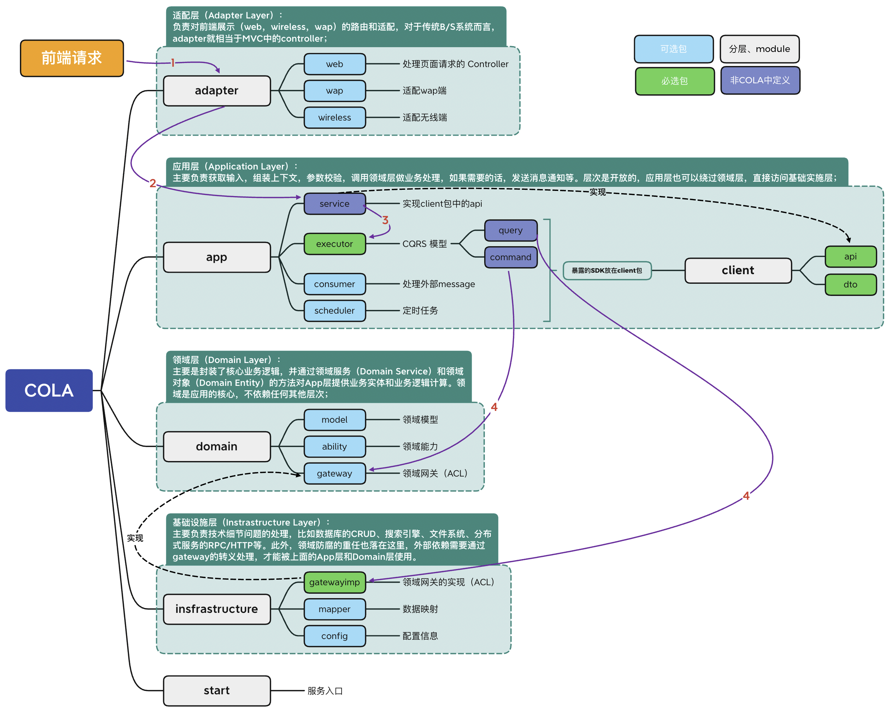

# Application Architecture Archetype（应用架构原型）
> By [Siu]() 2022/4/19

## 前言

前一段时间在整理后端的架构和选型，关于微服务设计这部分，也预留 DDD 的”作业“，但对于如何工程化落地 DDD 还没有一个清晰的思路，现有应用架构中的分层模型还是 MVC；关于领域划分，边界上下文、防腐层等 DDD 的经典理论抱有”赞同“，却又限制于没有实践指导的“工具”，故一直没有这部分的”行动“。

最近看了 COLA 的架构和一些设计，觉得 COLA 具有足够的理论依据也具有相当的落地实践性，是一个不错的 DDD 落地的方法论和实践指导，但个人在理解 COLA 的设计时还是觉得有一些问题。 主要集中在没有足够的场景案例去分析整个落地实践的路径，没有深入阐述分层分包的原则和实际开发联系；特别是 DEMO 上比较粗糙，与 COLA 阐述的一些架构原则没有呼应，细节上 COLA 中的 DEMO 不具典型意义；另外就是没有介绍对于 DDD 、CQRS 的借鉴，在架构和实践中的关系。

由此，并就想着开始准备自己组装一个 DDD 的落地实践，使用 COLA 的设计理念，融合微服务框架以及包含一些后端开发时会涉及的常用的库/组件（ORM、Flyawy、Skywaking、MapStruct、EventBus等），按照当前我个的理解把这个“脚手架”项目命名为 AAA（Application Architecture Archetype（应用架构原型）），希望能够真正落地实践 DDD，并用于实际项目指导目前团队的应用架构的演进。

> DDD 部分的知识来自《DDD 实战》的学习笔记整理。
>
> 例子大部分是使用原书中的案例，做了一些解读，脑图和架构图都是自己编辑的.
>
> 使用请遵循

## DDD

### 为什么选择 DDD

### 领域（Domain）

### 领域边界（Bounded-Context）

### 领域模型（Domain Model）

### 领域事件（Domain Event）

### 领域分层（Domain Layer）

### 微服务设计和拆分的原则

## COLA

## AAA （todo）

- [x] 确定领域（业务需求）
- [x] DDD 战略设计：事件风暴、领域故事分析
- [ ] DDD 战术设计：提取领域对象和代码做基本映射
- [ ] DDD 战术设计：框架搭建、编码
- [ ] 增加 flyway、MapStruct、领域事件（MQ）、微服务框架（API网关、服务发现注册等）、服务网格、模版代码

# ref

[DDD 里面的 CQRS 是什么？](https://www.51cto.com/article/644144.html)

[COLA 层次划分理解](https://github.com/alibaba/COLA/issues/203)

[COLA POJO 代码太多的讨论](https://github.com/alibaba/COLA/issues/271)
